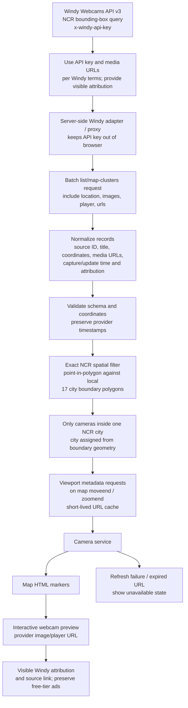

# Windy Webcam Integration: Metro Manila

BahaRoute will use the **Windy Webcams API v3** as its webcam metadata and media
source. The application scope remains the 17 cities and municipality of Metro
Manila (NCR); webcams outside those boundaries are discarded.

## Integration flow

## Windy API and refresh policy

- List webcams with `GET https://api.windy.com/webcams/api/v3/webcams` and the
  `bbox=northLat,eastLon,southLat,westLon` query parameter. For map-oriented
  results Windy also documents `/webcams/api/v3/map/clusters` with `northLat`,
  `eastLon`, `southLat`, `westLon`, and `zoom` parameters.
- Request needed location and media fields with the documented `include`
  modifier, currently `location,images,urls`. Authenticate with the
  `x-windy-api-key` header. Paginate within the free tier's listing limits and
  apply BahaRoute's exact polygon filter because the NCR bounding box includes
  areas outside Metro Manila.
- Query the webcams endpoint with the current viewport bounding box on map
  `moveend` and `zoomend`, clipped to the NCR coverage. Cache each bounded
  result for at most 5 minutes, leaving a margin before free-tier token expiry.
  Fetch one webcam by ID when its image popup opens, then renew only that image
  URL every 7 minutes. An image `error` triggers an immediate single-webcam
  refresh. Update the existing `` in place and do not serve stale URLs on
  provider failures.
- Windy's docs say free-tier image URL tokens expire after 10 minutes and
  recommend re-fetching webcam metadata when the page is loaded. Its pricing
  page currently lists free image URL validity as 15 minutes; using 10 minutes
  follows the more conservative documented expiry. These are expiring image
  URLs, not a guarantee of continuous live video. Refreshing metadata does not
  itself make a still-image camera a video stream.
- Windy's free tier limits image size and offset; this integration uses the
  provider-returned image URLs and links them to the webcam detail page. Do not
  reconstruct URLs or publish graphics from the camera images.
- Keep the API key server-side and do not expose it in browser Vite variables.
  Show the visible Windy attribution and links required by its terms, and do not
  block advertisements served through the free API.

## Metro Manila scope and filtering

1. Query Windy with a bounding box around Metro Manila to reduce the candidate
   set and API usage.
2. Normalize each provider record into the existing `TrafficCamera` schema in
   `src/types/camera.ts`, preserving the Windy webcam ID, title, coordinates,
   provider media URLs, capture/update time, and attribution.
3. Run every candidate through `filterMetroManilaCameras` in
   `src/services/metroManilaCameras.ts`. Keep a record only when its coordinate
   falls within exactly one of BahaRoute's local 17 LGU polygons. Geometry
   determines the city; provider labels are retained only as source metadata.
4. Cache only bounded viewport metadata for up to five minutes. On a failed
   refresh, do not reuse signed image URLs; each open popup can request its
   webcam record again by ID.
5. The map UI consumes only the filtered NCR records and displays
   markers, provider media, capture/update time, and attribution. Camera imagery
   does not change flood states, reports, confirmed closures, or route ranking.

## Current code status

The app has provider-neutral camera types, snapshot validation, local NCR
polygon filtering, viewport-bounded Windy requests, per-webcam image URL
renewal, and custom camera markers/popups. Configure `WINDY_WEBCAMS_API_KEY`
server-side to enable live records; the key is not exposed to browser code.

## References

- [Windy Webcams API v3 docs](https://api.windy.com/webcams/docs)
- [Windy Webcams API v2-to-v3 guide](https://api.windy.com/webcams/version-transfer)
- [Windy Webcams API pricing and free-tier limits](https://api.windy.com/webcams/pricing)
- [Windy Webcams API terms](https://account.windy.com/agreements/windy-api-webcams-terms-of-use)
